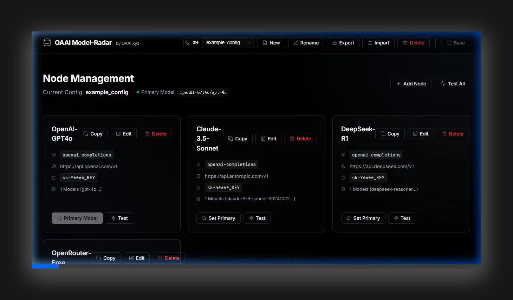
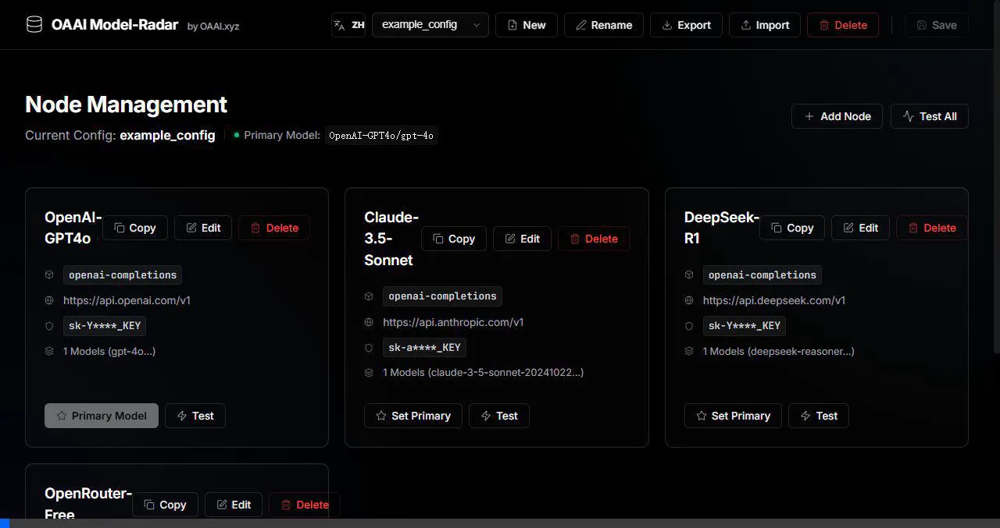

<div align="center">

# 🦀 OAAI Model-Radar


[](https://oaai.xyz)
[](https://oaai.xyz/model-radar/)

**Say goodbye to heavy gateways: a pure local, zero-dependency AI model API node radar and configuration manager.** <br>
*Brought to you by OAAI.xyz*

> 🌐 **[Online Demo → https://oaai.xyz/model-radar/](https://oaai.xyz/model-radar/)** &nbsp;*(Read-only preview — no sign-in required)*

</div>

---

## ✨ Interface Preview

<div align="center">
  
</div>

### 🚀 One-Click Concurrent Testing
Experience the lightning-fast concurrent connectivity test for all nodes:
<div align="center">
  
</div>

## 🎯 Why OAAI Model-Radar?

Are you tired of bloated API gateways? Hesitant to paste your precious OpenAI keys into random online speed-test sites? OAAI Model-Radar is specifically designed to solve these pain points:

| Feature / Pain Point | Traditional Gateways | Online Speed Testers | 🦀 OAAI Model-Radar |
| :--- | :--- | :--- | :--- |
| **Setup Complexity** | High (Requires DBs, Redis, etc.) | None | **Zero (One-click start)** |
| **Data Privacy** | Medium (Your server) | Low (Uploaded to cloud) | **Absolute (100% Local)** |
| **Dependencies** | Heavy (Node.js, Go, etc.) | N/A | **Zero (Python Standard Library)** |
| **Concurrent Test** | Usually not supported | Limited | **Full support for all nodes** |

## 🌟 Core Features

- **⚡ Pure Local & Zero Dependencies**: Built with Python's standard library. No need to install complex third-party dependencies.
- **🚀 Elegant Concurrent Testing**: Test latency and connectivity of multiple API nodes and models concurrently with one click.
- **🔐 True Local Security**: All configs and API keys are stored in local files. Not a single byte is uploaded to the cloud.
- **📂 Seamless Multi-Config Switching**: Create separate, independent configurations for different projects and switch effortlessly.
- **🐋 Out-of-the-Box Containerization**: Lightweight Docker support allows server deployment with a single command, ensuring auto-persisted data.

## 🚀 Quick Start

### Option A: Pure Local (Desktop Recommended)

Enjoy a "double-click to run" experience utilizing our minimal startup scripts.

**Windows OS:**
1. Double-click the `start.bat` file in the directory.
2. The script will initialize the service and automagically pop open `http://127.0.0.1:5000` in your default browser.

**Mac / Linux OS:**
```bash
# 1. Grant execution permissions
chmod +x start.sh

# 2. Launch the service (opens your browser automatically)
./start.sh
```

### Option B: Docker Deployment (Server Recommended)

Perfect for sysadmins. Operations and configurations will flawlessly persist within your local `configs/` directory.

```bash
# 1. Ensure Docker and Docker Compose are installed.
# 2. In the project root, run:
docker-compose up -d

# 3. Access via http://<SERVER_IP>:5000
```
To shut down, simply run `docker-compose down`.

## ⚙️ Configuration Structure

`OAAI Model-Radar` saves various configurations in the `configs/` directory inside standard JSON syntax. Structure logic is as follows:

```json
{
  "name": "My_First_Config",
  "providers": {
    "OpenAI": {
      "baseUrl": "https://api.openai.com/v1",
      "apiKey": "sk-xxx...",
      "models": [
        {
          "id": "gpt-4-turbo",
          "name": "GPT-4 Turbo"
        }
      ],
      "primaryModel": "gpt-4-turbo",
      "status": "available",
      "latency": 350,
      "lastTested": "2026-02-27T12:00:00.000Z"
    }
  }
}
```

## � License

This project is licensed under the [MIT License](LICENSE). Your Stars ⭐ and PRs are always welcome!

---
> Made with ❤️ by **[OAAI.xyz](https://oaai.xyz)**
